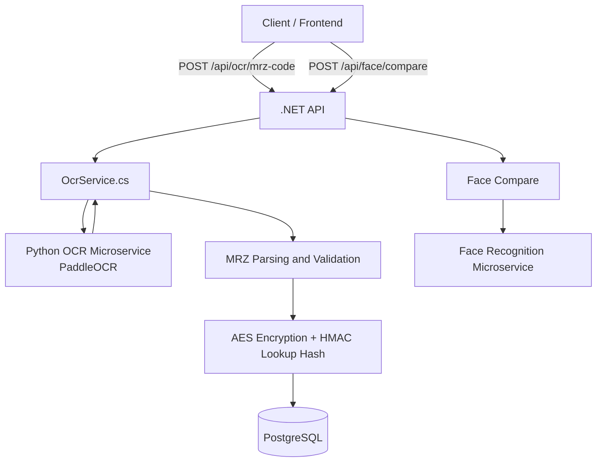

```mermaid
flowchart TD
    Client[Client / Frontend] -->|POST /api/ocr/mrz-code| API[.NET API]
    
    API --> OCR_Service[OcrService.cs]
    OCR_Service --> OCR_Python_Microservice[
    Python OCR Microservice
    PaddleOCR
    ]
    OCR_Python_Microservice --> OCR_Service
    OCR_Service --> MRZ_Parsing[MRZ Parsing and Validation]
    MRZ_Parsing --> AES_Ecryption[AES Encryption + HMAC Lookup Hash]
    AES_Ecryption --> Database[(PostgreSQL)]

    Client[Client / Frontend] -->|POST /api/face/compare| API[.NET API]
    API --> Face_Compare[Face Compare]
    Face_Compare --> Face_Recognition[
    Face Recognition Microservice
    ]
```