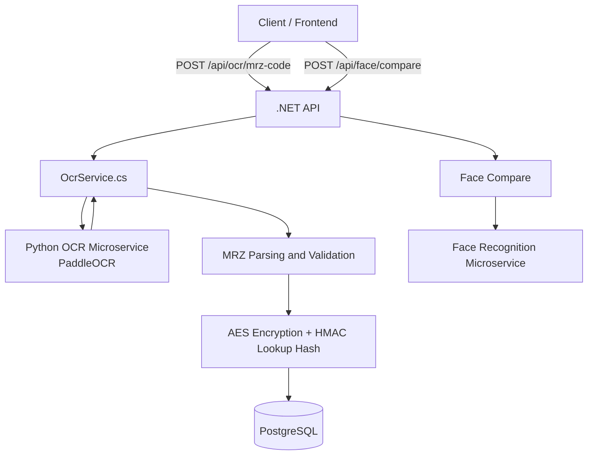

# Document Verification Pipeline

A KYC-like document verification pipeline built with **C#/.NET, Python, Docker, PostgreSQL, PaddleOCR and AWS Rekognition**.

The system provides:

* Document OCR using PaddleOCR
* MRZ extraction, parsing and validation
* AES encryption and HMAC lookup hashes
* Face comparison between selfie and document photo
* Dockerized microservices architecture

The .NET API acts as the main orchestrator, while OCR and face recognition run as separate services.

> Face matching alone is not sufficient to verify document authenticity. In production, this is typically handled by specialized third-party **document verification / identity verification providers** that offer **document authenticity checks, tampering detection, NFC verification, and liveness detection**. Due to limited resources, I decided not to implement the full document verification process from scratch.

